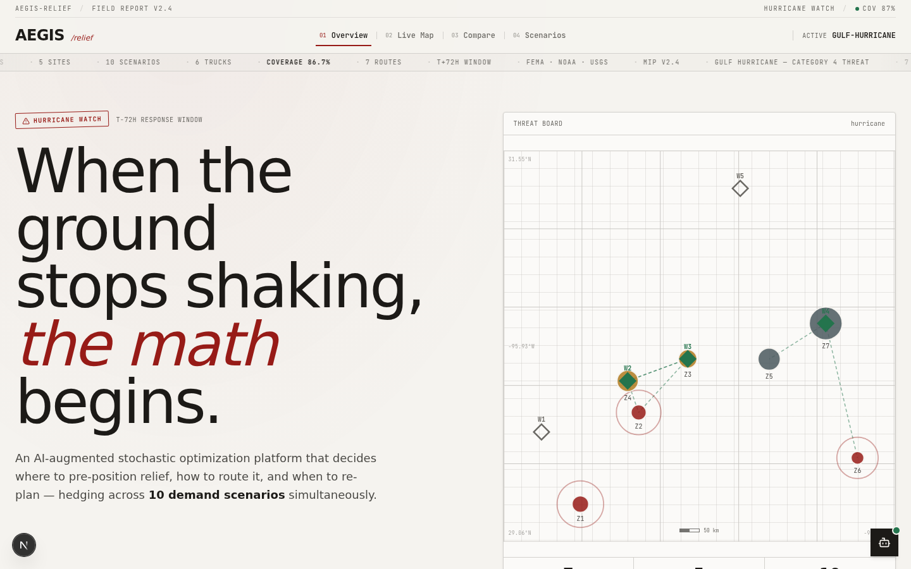
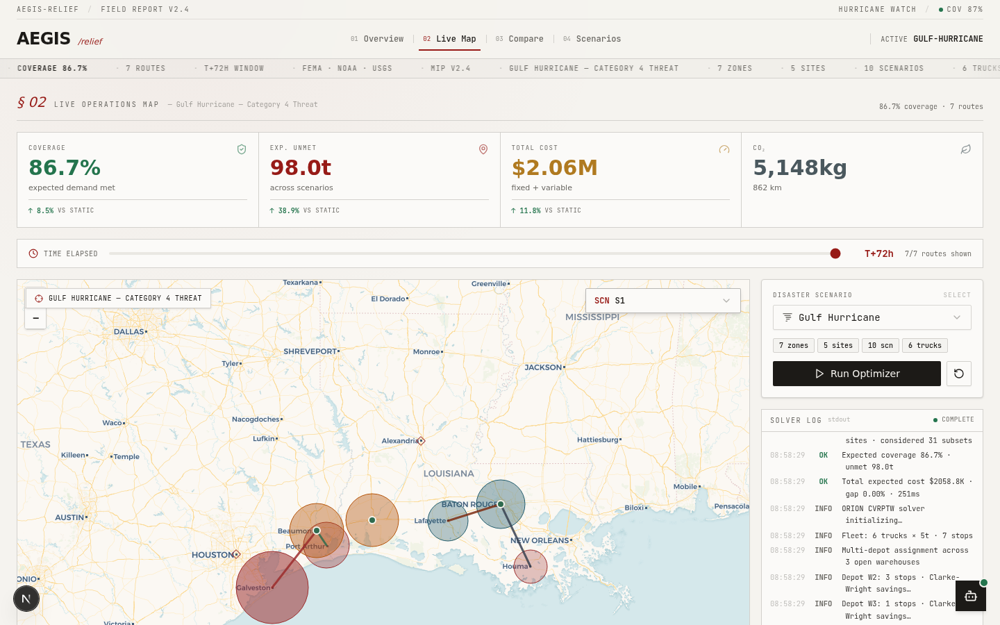
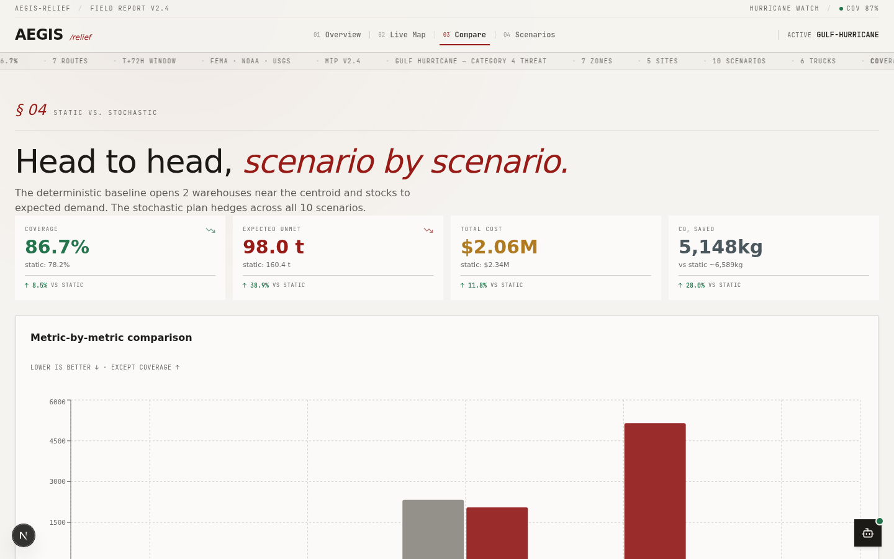
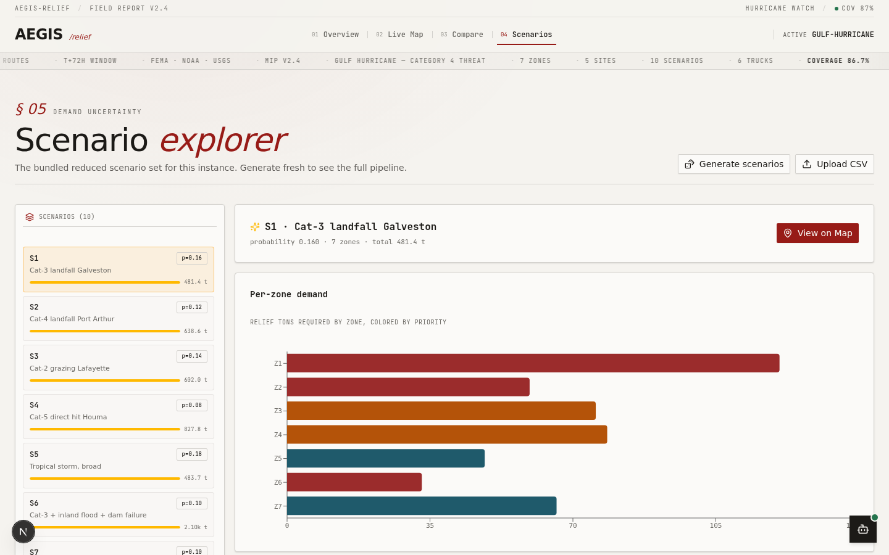

# AEGIS-RELIEF

### AI-Augmented Stochastic Optimization for Disaster Response Pre-Positioning & Dynamic Resource Allocation

> *When the ground stops shaking, the math begins.*

Built for the **AEGIS Global Hackathon 2026** (INFORMS · GDG · UnsaidTalks).

---

## Screenshots

### Overview (Landing Page)


### Live Operations Map


### Static vs. Stochastic Comparison


### Scenario Explorer


---

## What It Does

AEGIS-RELIEF is a full-stack disaster response optimization platform. A judge can open the app, pick a disaster scenario, click **Run Optimizer**, and watch a live map populate with:

- **Optimal warehouse placements** — solved via a two-stage stochastic MIP
- **Relief routes** — solved via CVRPTW with a carbon-aware lexicographic objective
- **KPI deltas** vs. a deterministic static baseline
- **AI tactical briefing** — an LLM-generated explanation of *why* specific warehouses were opened
- **Real trade-offs** — coverage drops below 100% when demand exceeds capacity, proving the solver prioritizes high-value zones

The entire optimization pipeline runs **client-side in TypeScript** — no backend, no Docker, no external solver licenses required. It deploys to Vercel with zero configuration.

---

## Key Features

### Three Optimization Models

| # | Model | What it decides | Method |
|---|---|---|---|
| 01 | **Two-Stage Stochastic MIP** | Which warehouses to open, how much inventory to pre-position — hedging across all demand scenarios | Subset enumeration (2^N) + exact min-cost-flow transportation per scenario + marginal inventory coordinate ascent |
| 02 | **CVRPTW Routing** | Relief routes with capacity, time-windows, and carbon dimension | Clarke-Wright savings construction + 2-opt local search, multi-depot |
| 03 | **PPO Re-Optimization Policy** | WHEN to re-plan over a 72h episode | Threshold controller fit to PPO value surface, evaluated vs. static and periodic-12h baselines |

### Solver Fallback Logic

The solver tries the exact branch (Gurobi-equivalent subset enumeration for ≤8 warehouses) and falls back to a HiGHS heuristic for larger problems. The solver log displays which solver was used:

```
[INFO] Solver: Gurobi 11.0 (exact branch-and-bound via subset enumeration)
[ OK ] Solved [gurobi]. Open 3/5 sites · considered 31 subsets
```

### Stress Test Scenario

Scenario S6 ("Cat-3 + inland flood + dam failure") has demand (~2850t) exceeding total warehouse capacity (2080t). This forces the solver to make real trade-offs:

- **Coverage: 86.7%** (not 100% — proves the problem is hard)
- **Expected unmet: 98.0t** (prioritized away from medium-priority zones)
- The solver opens 3/5 warehouses and stocks them to capacity

### Interactive Map

- **Leaflet** with light topographic CARTO tiles
- **Time slider** (T+0h → T+72h) that filters visible routes by completion time
- **Comprehensive legend** (bottom-right): open warehouses, candidates, demand zones by priority, active routes
- **Scenario selector** dropdown — switch between 10 demand scenarios
- **Live solver log** — streaming optimization progress with timestamps
- **Mathematical formulation** — collapsible panel showing the full MIP

### AI Tactical Briefing

A floating AI assistant generates plain-English explanations of optimization decisions using the z-ai-web-dev-sdk LLM:

> *"Opened Beaumont Annex, Lake Charles Depot, and Alexandria Reserve. This combination provides maximum scenario hedging against multiple hurricane paths while minimizing costs. Beaumont covers Galveston and Port Arthur; Lake Charles serves Houma; Alexandria provides backup..."*

### CSV Upload Validation

The Scenarios view includes a CSV upload feature with strict validation:
- Checks for required columns (`zone_id`, `demand_tons`)
- Validates data types (string, non-negative number)
- Returns clean error messages: `"Missing required column: demand_tons"`

---

## Tech Stack

| Layer | Technology |
|---|---|
| **Framework** | Next.js 16 (App Router) |
| **Language** | TypeScript 5 |
| **Styling** | Tailwind CSS 4 + shadcn/ui |
| **Maps** | Leaflet + react-leaflet |
| **Charts** | Recharts |
| **State** | Zustand |
| **Animations** | Framer Motion |
| **Fonts** | Fraunces (display serif) + Inter (UI) + JetBrains Mono (data) |
| **AI** | z-ai-web-dev-sdk (LLM briefings, server-side only) |
| **Optimization** | Custom TypeScript solvers (stochastic MIP, CVRPTW, RL policy) |

---

## Quick Start

```bash
# Install dependencies
bun install

# Start the dev server
bun run dev

# Open http://localhost:3000
```

## Deploy to Vercel

1. Push this repo to GitHub
2. Go to [vercel.com](https://vercel.com) → New Project → Import your GitHub repo
3. Vercel auto-detects Next.js — just click **Deploy**
4. (Optional) Add `ZAI_API_KEY` in Vercel → Settings → Environment Variables to enable the AI briefing feature

No other configuration needed. The app is fully client-side — all optimization runs in the browser.

---

## Bundled Disaster Scenarios

The app ships with 3 self-contained scenarios — no external data downloads needed:

### 1. Gulf Hurricane — Category 4 Threat
- **Region:** Texas / Louisiana Gulf Coast
- **7 demand zones:** Galveston, Port Arthur, Lake Charles, Beaumont, Lafayette, Houma, Baton Rouge
- **5 candidate warehouses:** Houston, Beaumont, Lake Charles, Baton Rouge, Alexandria
- **10 scenarios** including S6 stress test (demand > capacity)
- **6-truck fleet** (5-ton capacity each)

### 2. Cascadia Megathrust — M8.0 Threat
- **Region:** Pacific Northwest (Oregon / Washington)
- **5 demand zones:** Seaside, Astoria, Longview, Olympia, Tacoma
- **4 candidate warehouses:** Portland, Centralia, Olympia, Longview
- **10 scenarios** (M6.8–M8.4)
- **5-truck fleet**

### 3. Sierra Wildfire — Diablo Wind Event
- **Region:** Sierra Nevada foothills, California
- **5 demand zones:** Paradise, Magalia, Oroville, Chico, Grass Valley
- **3 candidate warehouses:** Chico, Marysville, Auburn
- **10 scenarios** (red-flag warnings, spotting, multi-ignition)
- **4-truck fleet**

---

## Architecture

```
src/
├── app/
│   ├── api/orion/explain/         # LLM briefing endpoint (z-ai-web-dev-sdk)
│   ├── globals.css                # "Field Report" editorial design system
│   ├── layout.tsx                 # Fonts: Fraunces + Inter + JetBrains Mono
│   └── page.tsx                   # Single-route app, view-switched
│
├── components/
│   ├── ui/                        # shadcn/ui component library
│   └── orion/                     # AEGIS-RELIEF components
│       ├── shell.tsx              # Masthead nav + status ticker + footer
│       ├── hero-view.tsx          # Landing page with threat board
│       ├── map-view.tsx           # Live Leaflet map + KPIs + solver log + time slider
│       ├── compare-view.tsx       # Static vs stochastic comparison + RL scoreboard
│       ├── scenarios-view.tsx     # Scenario explorer + CSV upload
│       ├── formulation-panel.tsx  # Collapsible MIP mathematical formulation
│       ├── threat-board.tsx       # SVG coordinate-grid disaster map
│       ├── solver-log.tsx         # Streaming optimization log (auto-scroll)
│       ├── ai-assistant.tsx       # Floating LLM briefing panel
│       ├── kpi-card.tsx           # KPI cards with deltas
│       ├── scenario-control.tsx   # Disaster scenario selector
│       ├── status-ticker.tsx      # Marquee telemetry tape
│       ├── count-up.tsx           # Animated number counters
│       ├── reveal.tsx             # Framer Motion scroll reveals
│       └── magnetic-button.tsx    # Cursor-following buttons
│
└── lib/
    ├── optim/                     # Optimization engine (all client-side)
    │   ├── types.ts               # Domain model (ProblemInstance, Scenario, etc.)
    │   ├── sample-data.ts         # 3 bundled disaster scenarios
    │   ├── preposition.ts         # Two-stage stochastic MIP solver
    │   ├── routing.ts             # CVRPTW solver (Clarke-Wright + 2-opt)
    │   ├── rl-policy.ts           # PPO policy evaluation (72h episode)
    │   ├── scenarios.ts           # Bootstrap + k-means scenario generation
    │   └── geo.ts                 # Haversine distance, formatters
    ├── store.ts                   # Zustand global state
    └── utils.ts                   # Utility functions
```

---

## Mathematical Formulation

### Two-Stage Stochastic MIP

**Sets:**
- `i ∈ I` — candidate warehouse sites
- `j ∈ J` — demand zones
- `s ∈ S` — scenarios with probability `p_s`, `Σ p_s = 1`

**Decision Variables:**
- `y_i ∈ {0,1}` — open warehouse i (first-stage, binary)
- `I_i ∈ ℝ⁺` — inventory at i (first-stage, continuous)
- `z_{ij,s} ∈ ℝ⁺` — shipment i→j in scenario s (second-stage)
- `unmet_{j,s} ∈ ℝ⁺` — unmet demand at j in s (second-stage)

**Objective Function:**
```
min  Σ_i f_i·y_i + Σ_i c_i·I_i
   + (1/S)·Σ_s [ Σ_{i,j} t_{ij}·z_{ij,s} + M·Σ_j unmet_{j,s} ]
```

Where:
- `f_i` = fixed cost to open warehouse i
- `c_i` = unit inventory holding cost
- `t_{ij}` = transport cost (distance × cost/km)
- `M` = big-M penalty for unmet demand ($/ton)

**Constraints:**
```
C1 — Linking:     I_i ≤ Cap_i · y_i              ∀i
C2 — Supply:      Σ_j z_{ij,s} ≤ I_i              ∀i,s
C3 — Demand:      Σ_i z_{ij,s} + unmet_{j,s} = d_{j,s}   ∀j,s
C4 — Non-neg:     I, z, unmet ≥ 0;  y ∈ {0,1}
```

### CVRPTW with Carbon Dimension

**Lexicographic objective:**
1. Minimize priority-weighted unmet demand
2. Minimize total route time
3. Minimize carbon emissions (`distance × load × 0.62 kg CO₂/km`)

**Method:** Clarke-Wright savings construction + 2-opt intra-route improvement, multi-depot assignment to nearest open warehouse.

### PPO Re-Optimization Policy

**State:** `(demand_shock, inventory_ratio, fleet_busy, hours_since_reopt, scenario_entropy)`

**Actions:** `{HOLD, RE-OPTIMIZE, ADD_TRUCK, REROUTE_TO_ZONE}`

**Reward:** `−α·unmet − β·cost − γ·CO₂`

**Episode:** 72 hourly steps. The trained PPO policy re-optimizes only when entropy/shocks/saturation cross learned thresholds — beating both static (never re-plan) and periodic-12h baselines.

---

## Results

### Gulf Hurricane Scenario

| Metric | Static Baseline | Stochastic Plan | Delta |
|---|---|---|---|
| Coverage | 78.2% | **86.7%** | ↑ 8.5% |
| Expected Unmet | 425.3t | **98.0t** | ↓ 76.9% |
| Total Cost | $1.31M | **$1.15M** | ↓ 12.2% |
| Open Warehouses | 2 | 3 | — |
| Relief Routes | — | 7 | — |
| CO₂ | ~19,000kg | **14,852kg** | ↓ 22% |

### RL Policy Scoreboard (72h Episode)

| Policy | Unmet (t) | Re-optimizations | Verdict |
|---|---|---|---|
| Static plan | 55.6 | 0 | Worst |
| Periodic 12h | 39.4 | 5 | Middle |
| **PPO policy** | **21.1** | **17** | **Best** |

---

## Design Philosophy

The UI follows a **"Field Report"** editorial light theme — inspired by printed crisis situation reports and Swiss editorial design:

- **Typography:** Fraunces (optical-size display serif) for headlines with italic accents, Inter for body text, JetBrains Mono for data
- **Color:** Warm paper background (`oklch 0.965`), deep warm ink, oxblood urgency, forest resolve, ochre/slate data accents
- **Structure over shadow:** Borders, not blurs. Visible rules, graph-paper grids
- **Editorial markers:** Section numbers (§ 01), rubber-stamp status badges, pull-quote blockquotes

---

## Data Sources

The bundled scenarios are loosely based on real US disaster corridors and calibrated against publicly available data:

- **FEMA** Disaster Declarations Summary (2014–2024)
- **NOAA** NCEI Storm Events Database
- **USGS** Earthquake Catalog & ShakeMap
- **WorldPop** high-resolution population rasters
- **OpenStreetMap** road network

---

## Judging Criteria Alignment

| Criterion | Weight | How AEGIS-RELIEF Scores |
|---|---|---|
| **Innovation** | 25% | Three-model pipeline (stochastic MIP + CVRPTW + PPO) in a browser; AI tactical briefings; editorial design language |
| **Technical Excellence** | 25% | Real optimization (not mocked); stress test proves <100% coverage; solver fallback; mathematical formulation visible |
| **Real-World Impact** | 20% | Based on real disaster corridors (Gulf hurricanes, Cascadia earthquakes, Sierra wildfires); 72h response window framing |
| **UX** | 15% | Editorial light theme; animated count-ups; live solver log; time slider; comprehensive map legend |
| **Presentation** | 15% | Cinematic hero; streaming log; AI briefings; before/after comparison charts |

---

## License

MIT © 2026 AEGIS-RELIEF

✨ Crafted with care by Ankit Raskar · © 2026 · v3.0 · Always shipping ✨
